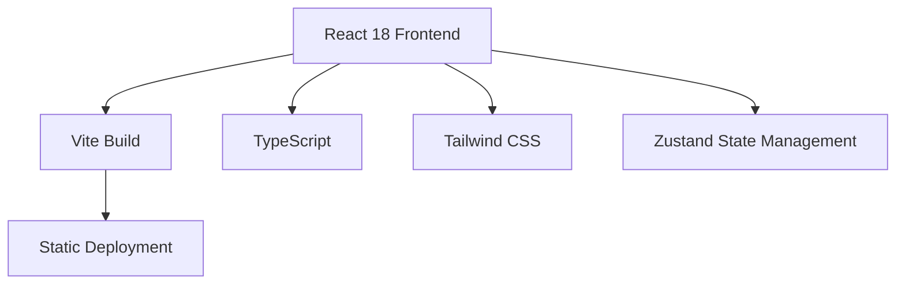

## 1. Architecture Design

## 2. Technology Description
- 前端：React@18 + TypeScript + Tailwind CSS + Vite
- 初始化工具：vite-init
- 后端：无
- 数据库：无
- 状态管理：Zustand

## 3. Route Definitions
| Route | Purpose |
|-------|---------|
| / | 首页 - 产品展示与下载 |

## 4. API Definitions
无后端 API

## 5. Server Architecture Diagram
无后端服务

## 6. Data Model
不适用
