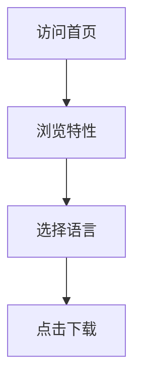

## 1. Product Overview
LunarByte_Zero 音乐软件官网 - 一个现代化、丝滑流畅的音乐软件展示页面。
- 展示音乐软件的核心特性、下载按钮和多语言支持
- 目标用户为音乐爱好者，提供优雅的视觉体验和清晰的产品信息

## 2. Core Features

### 2.1 User Roles
无特定用户角色区分，所有访客均可浏览和下载。

### 2.2 Feature Module
1. **首页**: 英雄区、特性展示、下载按钮、多语言切换
2. **悬浮导航栏**: 品牌标识、导航菜单、语言切换器

### 2.3 Page Details
| Page Name | Module Name | Feature description |
|-----------|-------------|---------------------|
| 首页 | 英雄区 | 动态背景、玻璃态卡片、软件名称展示 |
| 首页 | 导航栏 | 悬浮玻璃态菜单、品牌Logo、多语言切换 |
| 首页 | 特性展示 | 玻璃态卡片展示软件核心功能 |
| 首页 | 下载区域 | Android下载按钮、其他平台适配中提示 |
| 首页 | 页脚 | 版权信息、链接 |

## 3. Core Process
用户访问首页 → 浏览软件特性 → 选择语言 → 点击下载按钮

## 4. User Interface Design
### 4.1 Design Style
- 主配色：黑色为主，白色为辅，无其他配色
- 视觉效果：高玻璃液态效果、高透明度、高圆角
- 导航：悬浮式顶部菜单栏，非吸顶
- 图标：使用阿里巴巴图标库，禁止使用emoji
- 语言：繁体中文默认，支持英语、日语、俄语

### 4.2 Page Design Overview
| Page Name | Module Name | UI Elements |
|-----------|-------------|-------------|
| 首页 | 英雄区 | 渐变背景、玻璃态标题卡片、丝滑动画 |
| 首页 | 导航栏 | 玻璃态悬浮设计、品牌Logo、语言下拉菜单 |
| 首页 | 特性展示 | 玻璃态卡片网格、平滑滚动动画 |
| 首页 | 下载区域 | 玻璃态按钮、平台图标、适配提示 |

### 4.3 Responsiveness
桌面端优先，自适应移动端和触摸设备

### 4.4 3D Scene Guidance
不使用3D场景
